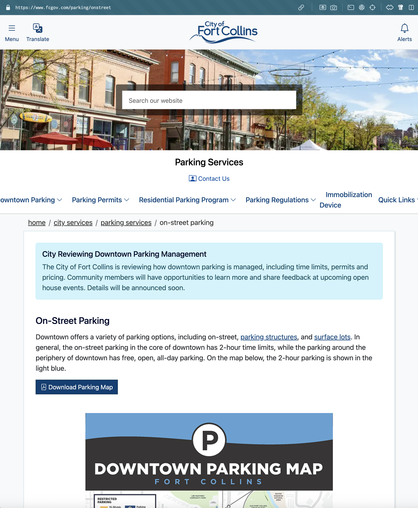



We are watched by devices for various purposes, all subject to spontaneous national security concerns from a Unitary Executive. Every company whether or not we touch it is actively profiling and patterning us. They exchange the same variety of data as every other.

### ParkMobile

Many, and most unwittingly, have designed our cities to require the intervention of private security systems to let the city function at its normal, now with freely obtained taxation on our precise locations and Privacy Policies. Some of these were set up by organizations or leadership groups in departments and offices you couldn't name nor estimate the size of. You have virtually no right to ask.

Parking meters with apps are collecting our license plates and acting as the gateway to dispatch staff to validate it. Whether or not they employ locals or pay well, our data becomes theirs. Were these devices to cease functioning in whole or in part, the parking fees may or may not get paid, who knows! The programmers tell us the spec document by the founders call it "undefined" in the scope. If the system's down, they said that's not in the spec sort of by Design. We just throw exceptions, baby.

Say your parking meter system does or doesn't collect payment, but inside of software details you're not allowed to look at might be code that fails the payment but due to the logging, your plate definitely goes out into the event queue. It's downstream's job to handle their own schema needs and control states.

But security humans know just what to do with no record of payment. That's not an error state, that's a Problem. You Are A Problem, because software engineers nationally centralize the precise location of parked vehicles in your city are while also learning how to communicate their weekly progress.

This isn't a hot industry, Or Is It? Don't you know? Don't you know either way? Why don't you know what these companies deploy in payment to run a nationally planned vehicle location registry? Do you know what their SLA says about outages? If you knew would it matter though? Do they disclaim they'll give everything away for a candy subpoena, local or federal? Are you electing CEOs to this unmonitored duty they've taken up for imagined profit?

Beyond the risk of cascading privacy and operational failures, software threats are active today and they are constantly successful. Leaders soften the blow to say only this and that data got away, and that we should look how hard they ran to fix it, again! Maybe American Exceptionalism makes an appearance, and they promise and resolve to stop sharing unmonitored admin accounts with foreign state operations by accident, or not monitoring the logs they have. They'll use language that indicates they believe in all the things they didn't do that time, but they're definitely experts at those things for a more natural performance "next time".

Did you know that sometimes IP addresses belonging to parking meters will reach out to your home network?

The skeleton key of national security looms over whatever the Unitary Executive desires, for its own Private plans. Congress today writes no Privacy Policy, just re-posts of the Executive's demands, sometimes across the lines of partisans.

### Privacy Policy

#### Cease of function

Companies have not earned new expedient rights to use our data for any project, whether or not we've ever seen their "Privacy Policy".

Companies do not earn the right to perform opt-in attacks on the public at their whim. We have created a culture where that is typical, but it must not always be. The targets of today's attacks don't even need to be "customers" whatever those are. Shall these companies, or any companies, get to deploy our personally identifiable information for their gain? Will they of course comply with national security orders to disclose, under the implicit threat of law, local or federal?

Shall we doubt anymore what the Unitary Executive will claim when it wants what companies have? National security is now a war cry. Replacing our order with their chaos is not a monumental task just because systems are big; demolishing a skyscraper-sized system is not done brick by unit brick, but with potential and then kinetic energy, with planning. Collapse is thing that can be Designed. Besetting us with problems is the Executive's method, to maybe make us waste ourselves on real symptoms while more appear.

The mass divestment of your privacy is a moral harm to all, and the effort is nationally centralized with companies who are rewarded for legal hippity hoppity. For sleepy social order or for national security, what do you think they are doing with your data besides? How do they make enough money to pay people to do it? Have you ever tried to start a business and do you understand how important money is for paying people, let alone affording a respectable CEO garnish?

Public education will be under attack for the foreseeable future, and knowledge is the only power we can send the children out the door possessing. Either call this off or indoctrinate our children in school early with Green Line theory, so they're capable of placing bets on their own loss of control—once they are legally allowed.

Can even the software that you do trust affirmatively be hacked and important data stolen? Are you agreeing to give data away anyway in a Privacy Policy or Terms document with a date on it? What first-hand claims do they make when they describe what they do with you and your location by literal Design? Can even the operating system you trust be hacked? The VPN? Isn't this all standard fare? This financial violence is too much.

Using Google One services, you can subscribe to be notified of your information appearing in stolen and secret-public datasets on the dark web. Dark web is what we called the parallel web-like networks that operate without reputable public partners. On one hand it is quite libertarian, but on the other it is where we are bought and sold, in addition to what is Designed as legal.

Have we agreed to Privacy at all? Do we think this is legally binding consent? Did we consent to this exactly, or is this an under-described rape reported only by them? When companies wage Lawfare, they do it with disclaimers and protections and limits against us, for their interests expressly. What do we get? The Service. The essential Service.

We must have Privacy law that is absolute on this, but we can't have that instantly. We do have the power to halt this flow on a case by case basis. No fluid brand is owed the right to use the data they've been entrusted with. If that's this company's entire monetization raison d'être, fire ParkMobile and hire your People.

ParkMobile's claim is that they can Improve their Services with our data, by developing anything new that they want, and which is obviously "not limited" to trends and visiting patterns. Why must every legal document fail-open like this? Their Privacy Policy isn't obscene, but in this most crucial of carve-outs, we are told they haven't even bothered completing the list. Maybe that's a rounding error to them, next to arbitrary new products for green line theories. They update this stuff all the time, last seen changed a month ago July 14 2025.

This information fails observability tests.

— [https://parkmobile.io/privacy-policy/](https://parkmobile.io/privacy-policy/){: rel="nofollow noopener"}

Are you ready to reelect "ParkMobile&trade; by Arrive" as your national vehicle registry, or do you personally have better ideas?

### Fort Collins

I ask you to know about your place.

Parking maps of Fort Collins unfortunately don't reveal which company runs the meters on basic honest inspection. More likely you'll just find out when you walk up to the branded meter. The Parking Services webpage found via Google which frames the important map doesn't disclose the company either, but there are pages where the logo is clearly used. The site is organized like a folder structure but the intended path to the "onstreet" page is not obvious from its parent page, and is busy with announcement information.

<aside class="side right">
  <iframe src="./exhibits/22-24140-parking-map-updates-april-2022.pdf" width="100%" height="400px" frameBorder="0" title="FC Parking "></iframe>
  <figcaption markdown="1">This map is doing a good job, minus the absence of a ParkMobile logo. — [https://www.fcgov.com/parking/files/22-24140-parking-map-updates-april-2022.pdf?1742597633](https://www.fcgov.com/parking/files/22-24140-parking-map-updates-april-2022.pdf?1742597633){: rel="nofollow noopener"}
  </figcaption>
</aside>

A curious user must take a second call to action to inspect the surface lots page found here, or use breadcrumbs to discover it, or just go. Ill will doesn't shape this, and there's no blame on "The City" whoever that is. Is it a problem? The missing disclosure or the unmitigated data taxation we are compelled to pay for the free use of our own cities?

<figure class="side left">
  
  <figcaption markdown="1">The Parking Services page is doing a good job, minus the absence of a ParkMobile logo.
    — [https://www.fcgov.com/parking/onstreet](https://www.fcgov.com/parking/onstreet){: rel="nofollow noopener"}
  </figcaption>
</figure>

Fort Collins is asking for feedback soon, and that's proactive! That's good metadata about this subject, and you can verify its existence for yourself. Those running a city make it their job to work in public view. They've rendered their intent, so answer with your preferred Terms.

#### What do you need?

What do you need from The City, whoever that is?

Did you know that you can just walk in and sign up to talk at them and they're not allowed to talk back unless they have clarifying questions?

The City is not an other, it is you. Without you there isn't a "The City". This City in this Country lets you represent your place. You are allowed by People's rules and charters and many many many documents besides—fruits of all incomparable kinds. Most of the time you get to participate in, watch, talk about, or commentate yourself with access, the declared and public meetings.

Don't be surprised that many fundamental and Privileged meetings exist that write the terms with private cooperation. I don't care what you lean, I am asking you to know the name of your City Council district representative(s) and decide if they represent you. I don't care what you answer, but I think you should discuss it and decide if you can do better than your representative(s). Decide if the city lawyer represents you. Do they speak in antique memes, or in coherent debate?

Unfortunately I won't be able to make a permanent commitment to the number of representatives present at past or future individual meetings. It's unpredictable because sometimes, such as in cities like Loveland, the number can be diminished by a recall, or perhaps a member is combined with an additional role.

Prepare in general to come to such a meeting space space early, an hour if you know it's already active. You can't know for sure if a current problem will put you on page two of the speaking log. (You're not going get to speak if you're not within their attention spans. Do you know how long those meetings are? How many happen a month? For which councils and other org words? You can seek this information out yourself right now.)

By my eye, people deny the members of the council their contact information for follow up. Do you know how often new ideas actually walk into that building? Are you there to change something or not?

Watch some recorded meetings, and decide if you can name better advice. If you don't like how hard it is to get access to meetings or agendas, then you may not need convincing to know that this is called a complaint.

Better advice is infectious because everyone knows it when they hear it.

Do you have better advice to give? Do you care enough to be contacted about it?

#### Private Taxation

This vast machine disavows the notion of responsibility for any action it produces. It blames and exonerates its parts in all its mechanical breaths, as each cog works its way. How could we blame all of it for a whole scheme, let alone any one of its parts?

We blame not the cogs, we blame the contract. We suffer digital assaults like radiation in the background.

Every vast machine drafts Privacy's express limits, with lawyers present (Shall we assume their experience?) acting with fiduciary responsibility to the shareholders; Oh my, where did it all go wrong?

Did the corporations not become “people” a touch more recently than us? Corporate cultural memory makes them wise or something, and the CEOs expect it to matter more than the People's cultural memory. Your City existed before companies grew legs, let alone before a CEO grew a mouth to do PR with.

The taxation of our data is undisclosed, uncontrolled and unmonitored, and so very rapidly managed by AI. It is without our Representation, and for legal reasons, barely without theirs.

We are told that our Rights may change at any time, and the US Supreme Court agrees class actions should be harder. We possess the same power to change their rights at any time, and we (sometimes?) write documents to try.

If your representation is failing you, trust them to be straight as an arrow on that. Living in this world and in This City, you have found skills by your nature, and you can do better than most.

Can you imagine with me, if companies did not possess the right to wield magic against us with an unchecked Privilege?

You may be surprised to know that it requires a certain number of users in your state before a company is liable for any standard legal framework.

I once untrusted a company operating from Seoul after they modified the privacy status of data. A May 2015 “weekend project” that grew lawyers in a foreign country doesn't have to obey CO law anyway.

- [https://www.rezi.ai/about](https://www.rezi.ai/about){: rel="nofollow noopener"}

Government moved slow for a reason. Now, there is a legal class of "people" who Privilege themselves to move faster and with immaculate Privacy for themselves, and they are all Foreign and Domestic capable and encouraged towards our exploitation for profit. All for a fleet of Green Lines that must, must go up.

Are we tired? Do they say keep running? Do they deploy to AI to enact this assault while they take a hard-earned sleep?

CEOs work hard and for their own Good they say to us sometimes: Take This Million Dollars And Do What I Tell The Camera. I Can Fix All Your Problems By Giving You Back What I Withhold To Create Need In A Free Market.

Money is payoff, it's the fulfillment of their plot against you, not change. I beg you consider what Free means to our two classes of People and corporate "people" and whether the Founders had opinions on Privacy Policies.

Make Privacy our Terms. Tell people what you mean by that. You are electable. You are more Person than any of these companies. Get help writing your Terms. Take away their intangible powers by remembering you hold power first. We have already listened to their interests ad nauseam, which they have been making us "implicitly sign" for the privilege of moving about our own cities.

We have at times read their "terms" and we do not respect them. Their growing season must slow.
